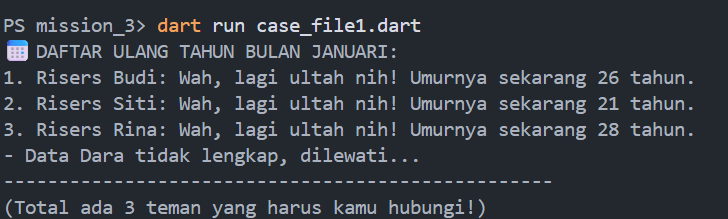
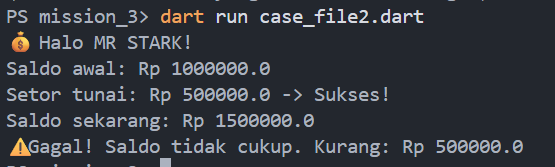
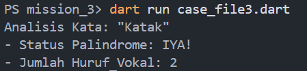

# Mission #3 : Dart Basic Logic - Case Files

Dokumentasi singkat untuk tiga program Dart yang berisi latihan logika dasar dan pemrosesan data.

## Ringkasan

Project ini berfokus pada:

- Pemrosesan daftar data (filter bulan, validasi, dan perhitungan umur).
- Penerapan OOP sederhana untuk simulasi rekening bank.
- Analisis string untuk palindrome dan perhitungan huruf vokal.

## Struktur Singkat

- `case_file1.dart`: Daftar ulang tahun berdasarkan bulan saat ini, validasi data, dan hitung umur.
- `case_file2.dart`: Simulasi rekening bank dengan fitur setor/tarik dan validasi saldo.
- `case_file3.dart`: Cek palindrome serta menghitung jumlah huruf vokal.

## Penjelasan Setiap Langkah

1. **Pemrosesan Data Ulang Tahun (`case_file1.dart`)**
   - Menyimpan daftar teman beserta tanggal lahir.
   - Memfilter data berdasarkan bulan saat ini.
   - Menghitung umur dan melewati data kosong/tidak valid.

2. **Simulasi Rekening Bank (`case_file2.dart`)**
   - Membuat class `BankAccount` dengan properti `namaPemilik` dan `saldo`.
   - Menyediakan metode `setor()` dan `tarik()` dengan validasi input.

3. **Analisis Kata (`case_file3.dart`)**
   - Normalisasi kata ke huruf kecil.
   - Mengecek apakah kata adalah palindrome.
   - Menghitung jumlah huruf vokal.

## Cara Menjalankan Kode

Pastikan sudah menginstall Dart SDK.

Jalankan salah satu file dari root project:

```bash
dart run case_file1.dart

dart run case_file2.dart

dart run case_file3.dart
```

## Screenshot Output Terminal

Output terminal untuk `case_file1.dart`:



---

Output terminal untuk `case_file2.dart`:



---

Output terminal untuk `case_file3.dart`:



## Link GitHub Repository

Tautan repository:

- [https://github.com/fajri-playground/mission_3](https://github.com/fajri-playground/mission_3)
